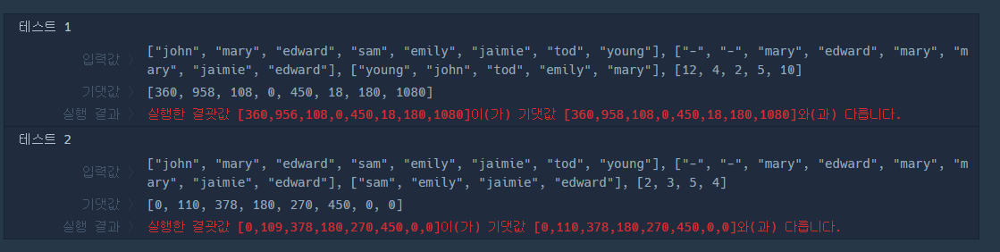

# 문제
[프로그래머스 다단계 문제 링크](https://programmers.co.kr/learn/courses/30/lessons/77486)
# 내 생각
재귀를 통한 트리탐색 문제다. 허나 왠지모르게 숫자를 더하고 빼는 부분에서 자꾸 1정도의 오차가 생겨 결국 문제
해결에 실패했다. 숫자 반올림하고 이런거에 좀 취약한것 같다 보완하자.
# 내 코드
```java
import java.util.*;

class Solution {

    ArrayList<ArrayList<String>> graph = new ArrayList<>();
    int[] answer;

    public int[] solution(String[] enroll, String[] referral, String[] seller, int[] amount) {
        answer = new int[enroll.length];

        for(int i = 0; i < enroll.length; i++) {
            graph.add(new ArrayList<>());
        }
        for(int i = 0; i < referral.length; i++) {
            String r = referral[i];
            if(r.equals("-")) continue;
            graph.get(i).add(r);
        }

        for(int i = 0; i < seller.length; i++) {
            String s = seller[i];
            int a = amount[i] * 100;
            int sellerIndex = Arrays.asList(enroll).indexOf(s);
            dfs(sellerIndex, a, enroll);
            Arrays.toString(answer);
        }

        return answer;
    }

    private int dfs(int index, int amount, String[] enroll) {
        if(graph.get(index).size() == 0) {
            if(enroll[index].equals("mary") || enroll[index].equals("john")) {
                answer[index] += (int) (amount * 0.9);
                return amount;
            }
            answer[index] += amount;
            return amount;
        }

        int nextIndex = Arrays.asList(enroll).indexOf(graph.get(index).get(0));
        answer[index] += amount - dfs(nextIndex, amount / 10, enroll);
        return amount;
    }
}
```


# 답안
답안에서는 반복과 재귀 2개의 방법을 이용하여 문제를 풀었다. 나와 논리는 같지만 코딩실력이 많이 다르다 ㅎㅎ...
```java
import java.util.*;

class Solution {
    public int[] solution(String[] enroll, String[] referral, String[] seller, int[] amount) {
        int[] answer = new int[enroll.length];

        Map<String, String> parentMap = new HashMap<>();
        Map<String, Integer> memberIndexMap = new HashMap<>();

        for(int i = 0; i < enroll.length; i++) {
            parentMap.put(enroll[i], referral[i]);
            memberIndexMap.put(enroll[i], i);
        }

        for(int i = 0; i < seller.length; i++) {

            String now = seller[i];
            int profit = 100 * amount[i];

            while(!now.equals("-")) {
                int profitForParent = profit / 10;
                int nowProfit = profit - profitForParent;

                answer[memberIndexMap.get(now)] += nowProfit;

                now = parentMap.get(now);
                profit /= 10;

                if(profit < 1) {
                    break;
                }
            }
        }

        return answer;
    }
}
```
